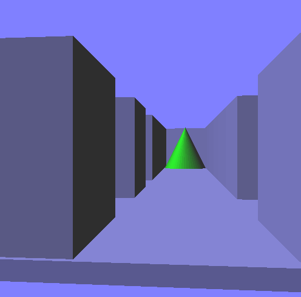
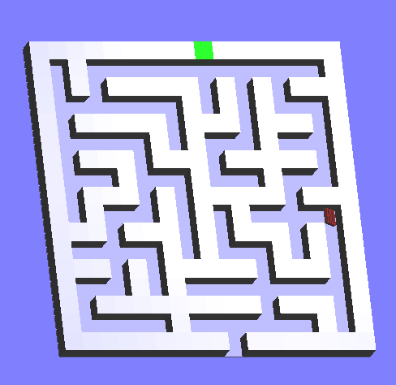

# **Hunters Maze Game Portfolio**

**Introduction**

The Hunters Maze Game is meant to provide a seamless and engaging gameplay experience, creating a maze game requires many critical technological and architectural concerns. There is a top-down shooter where the player's objective is to survive waves of enemies. You want to create an enemy AI behavior that presents a significant challenge to players. 

**Features**

Conventionally, the graphics and rendering of the Hunters Maze Game is such that it uses 2D and 3D graphics libraries libraries and shaders for rendering effects, such as lighting, shadows, and particle systems. The images highlight the game’s sequencing.

The Hunter enemy dynamically tracks the player's movement and predicts their position based on the player's velocity and direction. When the player is in a specific range, the Hunter enters the command "ambush" or the maze state. In this state, it calculates potential paths the player might take and chooses the path that leads to the player's anticipated position. 

When the player shoots at the Hunter, it exhibits evasion behavior, attempting to dodge incoming projectiles while still staying on course to ambush the player. As the player progresses, the Hunter's behavior becomes more challenging. It adapts its tracking accuracy, ambush planning, and evasion maneuvers based on the player's skill level.

**About**

My team member and I were not certain on what we could indulge with for the project but after the project was released, we decided that we would do what seemed impossible by working on the maze project. We desired to transform it into a story that suited our theme of using ALX as an opportunity to refine our developing skills to suit the modern market needs.

Hunters Maze Game was birthed out of a desire to take on an existing challenge and explore an existing option that would make it better. We commenced this project on the first week of August 2023 and had it completed on the second week of September 2023.

This is a Portfolio Project for **Holberton School** (https://www.holbertonschool.com/).

**Frazier Omondi Socials**
LinkedIn:		https://www.linkedin.com/in/frazier-omondi-742534b7/
Github:			https://github.com/Frazier-Creation

**Isaac Githinji Socials**
Linkedin: 		      https://www.linkedin.com/in/silvester-muriithi-57499b1aa/
Twitter Username: 	IsaacMuriithi46
Github: 		        https://github.com/SilGithinji
